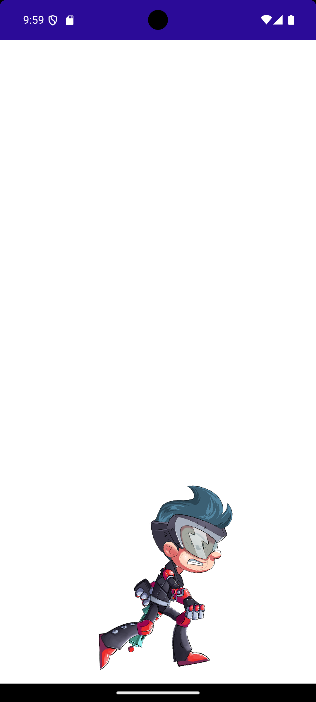
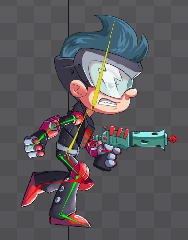

# Spine-skiasharp
A skiasharp renderer for Spine 2D animations for dotnet Maui

Open the Spine-Skiasharp.sln with Visual Studio.
Set spine-skiasharp as startup project if needed, build and deploy on Android or iOS somulator.

Spine-csharp is provided as is by Esoteric Software.
https://fr.esotericsoftware.com/
https://github.com/EsotericSoftware/spine-runtimes

The Engine.SpineSkiaSharpRenderer need to be repair. Some help would be appreciated to find the right algorithm.

What we have : 

What we should have : 
